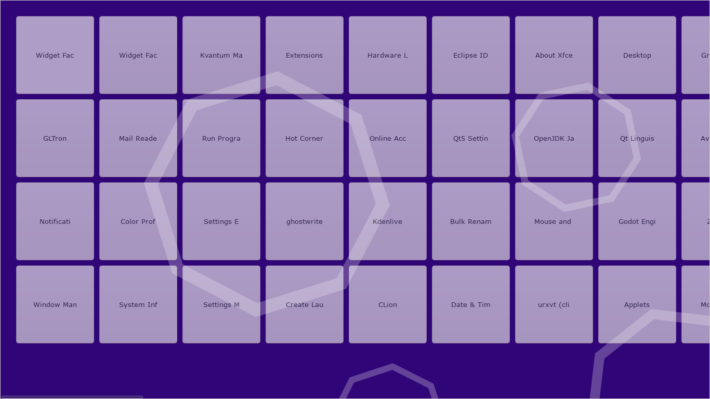

# The Octo Desktop Environment

## Purpose
The Octo Desktop Environment aims to be an open-source implementation of Windows 8/8.1's interface.
**CAUTION: THIS PROJECT IS IN VERY EARLY DEVELOPMENT. IT IS NOT EVEN A DESKTOP ENVIRONMENT YET, IT IS JUST A VERY PRIMITIVE APP LAUNCHER.**

### Why copy a failed operating system?
Windows 8 had a lot of potential. It is reminiscent of a window manager like i3 or dwm, where the windows can switch between tiled and floating. It also had many other programs beside the start menu, like the search panel and charms bar, which hopefully will be implemented eventually into this project. However, one of my biggest fears is that it will come too close to GNOME.

## To-do list
- Add draggable app tiles
- Add resizeable app tiles
- Add search function
- Add icons in app tiles
- Tiling functionality
- Make search panel that can search files, apps, and settings

## Build
Simply run `make`, which will compile the program into an executable `main`. To run, type `./main`.

## Contributing
Want to contribute? If you don't know how to code, please add an issue. If you do, please add a pull request.

## Directory Structure
**src**: contains C source files (`*.c`)
**include**: contains C header files (`*.h`)
**ui**: contains GtkBuilder file (`octo.xml`)

## About
Ancient Straits (email: ancientstraits@protonmail.com)
